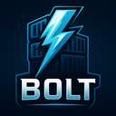

<p align="center">
  
</p>

<h1 align="center">Bolt</h1>

<p align="center">
  <strong>Next-Generation Container Runtime & Orchestration</strong>
</p>

<p align="center">
  
  
  
  
  
  
  
</p>  

---

## Overview

**Bolt** is a **next-generation container runtime** designed for gaming, development, and enterprise workloads.
It unifies:

- **Container Runtime** - OCI compatibility with sub-microsecond GPU passthrough via **nvbind**
- **Orchestration** - Surge orchestration with **TOML Boltfiles**
- **Snapshots** - BTRFS/ZFS snapshot automation with retention policies
- **Gaming** - First-class GPU support, Wine/Proton integration, ultra-low latency
- **Networking** - QUIC protocol for high-performance container communication
- **Declarative Config** - Reproducible environments with comprehensive validation

**Key innovations:**
- 🚀 **nvbind integration** - 100x faster GPU passthrough than Docker
- 📸 **Snapshot automation** - Time, change, and operation-based triggers
- 🎮 **Gaming-first design** - DLSS, Ray Tracing, Wine optimization
- ⚡ **QUIC networking** - Sub-microsecond container communication
- 🔧 **Modern CLI** - Docker-compatible commands with enhanced output  

---

## Install

```bash
curl -fsSL https://bolt.cktech.org | bash
```

---

## Quick Start

### Container Management
```bash
# Run containers with nvbind GPU runtime
bolt run --runtime nvbind --gpu all ubuntu:latest
bolt run --name web --ports 8080:80 nginx:latest

# List containers with modern output
bolt ps
bolt ps -a

# Container lifecycle
bolt restart web --timeout 30
bolt stop web
bolt rm web --force
```

### GPU & Gaming
```bash
# Configure nvbind GPU runtime
bolt gaming gpu nvbind --devices all --performance ultra --wsl2
bolt gaming gpu check
bolt gaming gpu list

# Launch gaming workloads
bolt gaming launch steam
bolt gaming wayland
```

### Snapshots
```bash
# Create snapshots
bolt snapshot create --name "before-update" --description "Before system update"
bolt snapshot list --verbose

# Rollback and cleanup
bolt snapshot rollback stable-config
bolt snapshot cleanup --dry-run
```

### Orchestration
```bash
# Multi-service orchestration
bolt surge up
bolt surge down
bolt surge status
bolt surge logs --follow
```

### Networking & Volumes
```bash
# Create QUIC networks
bolt network create gaming-net --driver bolt --subnet 172.20.0.0/16
bolt network ls

# Manage volumes
bolt volume create game-data --size 100GB
bolt volume ls
```

---

## Why Bolt?

Containers today are fragmented:  
- Docker is runtime-focused but aging.  
- Kubernetes is powerful but bloated.  
- Nix provides reproducibility but not simple orchestration.  
- Proxmox offers lightweight virtualization, but not modern runtime portability.  

**Bolt unifies these ideas into one coherent stack**.  
It’s designed to be **developer-friendly**, **secure by default**, and **scalable across bare metal, cloud, and homelabs**.  

---

## Design Goals

- ⚡ **Performance First**
  Rust runtime with zero-cost abstractions, memory safety, and low overhead.  

- 🧩 **Declarative Configs**  
  TOML Boltfiles for clarity, reproducibility, and version control.  

- 🔐 **Security by Default**
  Signed manifests, encrypted networking, rootless containers, and Rust's memory safety.

- 🌐 **Protocol-Native Networking**
  QUIC networking, DNS resolution, and authentication integrated from day one.  

- 📦 **Capsules**  
  Bolt’s native, LXC-like container: lightweight, snapshot-ready, and resource-efficient.  

- 🛠 **Unified Orchestration**  
  Surge integrates service orchestration directly into Bolt — no external tooling required.  

---

## Configuration: Boltfile (TOML)

Bolt uses **TOML Boltfiles** for comprehensive project configuration including services, snapshots, networking, and GPU settings.

### Gaming & GPU Configuration
```toml
project = "gaming-setup"

# Gaming service with nvbind GPU runtime
[services.steam]
image = "ghcr.io/games-on-whales/steam:latest"
ports = ["8080:8080"]

[services.steam.gaming.gpu]
runtime = "nvbind"                    # 100x faster GPU passthrough
isolation_level = "exclusive"         # Dedicated GPU access
memory_limit = "8GB"

[services.steam.gaming.gpu.nvbind]
driver = "auto"                       # Auto-detect driver
devices = ["gpu:0"]                   # GPU device selection
performance_mode = "ultra"            # Performance profile
wsl2_optimized = true                 # WSL2 optimizations

[services.steam.gaming.gpu.gaming]
profile = "ultra-low-latency"         # Gaming profile
dlss_enabled = true                   # DLSS support
rt_cores_enabled = true               # Ray tracing
wine_optimizations = true             # Wine/Proton optimizations

[services.steam.gaming.audio]
system = "pipewire"                   # Audio system
latency = "low"                       # Low latency audio
```

### Snapshot Configuration
```toml
[snapshots]
enabled = true
filesystem = "auto"                   # Auto-detect BTRFS/ZFS

[snapshots.retention]
keep_daily = 7                        # Keep 7 daily snapshots
keep_weekly = 4                       # Keep 4 weekly snapshots
keep_monthly = 6                      # Keep 6 monthly snapshots
max_total = 50                        # Maximum total snapshots

[snapshots.triggers]
daily = "02:00"                       # Daily at 2 AM
before_build = true                   # Before image builds
before_surge_up = true                # Before surge operations
min_change_threshold = "100MB"        # Only if >100MB changed

[[snapshots.named_snapshots]]
name = "stable-config"
description = "Known working configuration"
keep_forever = true
```

### Network Configuration
```toml
[networks.gaming-net]
driver = "bolt"                       # QUIC networking
subnet = "172.20.0.0/16"
gateway = "172.20.0.1"
```

Launch your stack:
```bash
bolt surge up
```
--- 
## Roadmap

### Phase 1 – Core Runtime ✅ **COMPLETE**
- [x] OCI image support (pull, build, run)
- [x] Bolt **Capsules** (LXC-like isolation)
- [x] Rootless namespaces & cgroups integration
- [x] Container lifecycle management (run, stop, restart, rm)
- [x] Enhanced container listing with modern output formatting

### Phase 2 – GPU & Gaming Runtime ✅ **COMPLETE**
- [x] **nvbind GPU runtime integration** - Sub-microsecond GPU passthrough
- [x] Docker compatibility layer with enhanced performance
- [x] Gaming-optimized container configurations
- [x] GPU device selection and isolation
- [x] Wine/Proton container integration
- [x] Real-time gaming optimizations

### Phase 3 – Snapshot Automation ✅ **COMPLETE**
- [x] **BTRFS/ZFS snapshot automation** with snapper-like functionality
- [x] Time-based triggers (hourly, daily, weekly, monthly)
- [x] Operation-based triggers (before builds, surge operations)
- [x] Change-based triggers with file monitoring
- [x] Retention policies with automatic cleanup
- [x] Named snapshots for specific configurations

### Phase 4 – Surge Orchestration ✅ **COMPLETE**
- [x] **Surge orchestration** - Docker Compose-like multi-service stacks
- [x] Boltfile (TOML) parser & schema validation
- [x] Multi-service orchestration (`bolt surge up`)
- [x] Service dependencies and health checks
- [x] Networking & DNS resolution
- [x] Persistent storage & volume support

### Phase 5 – Advanced Platform ✅ **COMPLETE**
- [x] Secure service authentication
- [x] QUIC networking for distributed services
- [x] Declarative builds (Nix-like reproducibility)
- [x] Web UI (Proxmox-style for capsules & clusters)
- [x] Remote orchestration across multiple nodes  

---

## Comparisons

| Feature              | Docker + Compose | Kubernetes | NixOS | Proxmox/LXC | **Bolt + Surge** |
|----------------------|------------------|------------|-------|-------------|------------------|
| Runtime              | ✅               | ✅         | ❌    | ✅          | ✅ (OCI + Capsules) |
| Orchestration        | ✅ (basic)       | ✅ (complex)| ❌    | ❌          | ✅ (Surge built-in) |
| GPU Runtime          | ❌ (slow)        | Limited    | ❌    | ❌          | ✅ (nvbind - 100x faster) |
| Snapshots            | ❌               | ❌         | ✅    | ✅ (manual) | ✅ (automated BTRFS/ZFS) |
| Gaming Support       | ❌               | ❌         | Limited| ❌         | ✅ (DLSS, RT, Wine optimized) |
| Config Format        | YAML             | YAML/JSON  | Nix   | Conf files  | TOML (clean) |
| Reproducibility      | ❌               | Partial    | ✅    | ❌          | ✅ |
| Virtualization       | ❌               | ❌         | ❌    | ✅          | ✅ |
| Secure by Default    | ❌               | Limited    | ✅    | ❌          | ✅ |
| Learning Curve       | Low              | High       | Medium| Medium      | Low |

---

## Requirements

- **Rust 1.85+** (Required for latest async/await optimizations and performance improvements)
- **Linux Kernel 5.4+** (For container namespaces and cgroups v2 support)
- **Tokio 1.0+** (Async runtime integration)

---

## 🚀 Rust API Integration

Bolt provides a **production-ready Rust API** for programmatic container management:

### **Quick Start**

Add to your `Cargo.toml`:
```toml
[dependencies]
bolt = { git = "https://github.com/CK-Technology/bolt" }
tokio = { version = "1.0", features = ["full"] }
```

### **Basic Usage**
```rust
use bolt::api::*;

#[tokio::main]
async fn main() -> bolt::Result<()> {
    let runtime = BoltRuntime::new()?;

    // Run containers
    runtime.run_container("nginx:latest", Some("web"), &["8080:80"], &[], &[], false).await?;

    // Gaming containers with GPU
    let gaming_config = GamingConfig {
        gpu: Some(GpuConfig { nvidia: Some(NvidiaConfig { dlss: Some(true), .. }), .. }),
        wine: Some(WineConfig { proton: Some("8.0"), .. }),
        ..
    };

    runtime.add_gaming_service("steam", "bolt://steam:latest", gaming_config);
    runtime.surge_up(&[], false, false).await?;

    Ok(())
}
```

### **Integration Examples**

**🎮 Ghostforge (Gaming Container Management):**
```rust
// Create gaming-optimized containers with GPU passthrough
let runtime = BoltRuntime::new()?;
runtime.setup_gaming(Some("8.0"), Some("win10")).await?;
runtime.launch_game("steam://run/123456", &[]).await?;
```

**🖥️ nvcontrol (GPU Management):**
```rust
// Allocate GPU resources to Bolt containers
runtime.create_network("gpu-net", "bolt", Some("10.2.0.0/16")).await?;
runtime.run_container("bolt://gpu-workload", None, &[], &[], &[], false).await?;
```

**📦 Programmatic Boltfiles:**
```rust
let boltfile = BoltFileBuilder::new("my-project")
    .add_gaming_service("game", "bolt://steam:latest", gaming_config)
    .build();

config.save_boltfile(&boltfile)?;
```

### **Feature Flags**
```toml
bolt = { git = "https://github.com/CK-Technology/bolt", features = ["gaming", "quic-networking"] }
```

- `gaming` - Gaming optimizations, GPU support, Wine/Proton
- `quic-networking` - Ultra-low latency QUIC networking
- `oci-runtime` - Full OCI container support
- `nvidia-support` - NVIDIA GPU passthrough
- `amd-support` - AMD GPU support

---

## 📚 Documentation

Comprehensive documentation is available in the [`docs/`](docs/) directory:

- **[Planning & Roadmap](docs/planning/)** - Development priorities and wishlist
- **[Architecture](docs/architecture/)** - System design and integration patterns
- **[Features](docs/features/)** - GPU support, gaming, and networking
- **[Integrations](docs/integrations/)** - MCP, GhostForge, and ecosystem tools
- **[nvbind](docs/nvbind/)** - GPU passthrough integration details
- **[API Reference](docs/api/)** - Complete API documentation
- **[MCP Integration](docs/mcp/)** - Model Context Protocol guides

See [docs/README.md](docs/README.md) for the complete documentation index.

---

## Ecosystem Integration

Bolt integrates with modern Rust ecosystem libraries for enhanced functionality:

- **Cryptography** → Secure networking and container signing
- **QUIC Networking** → Ultra-low latency transport
- **DNS Resolution** → Service discovery and networking
- **Authentication** → Secure service-to-service communication
- **Async Runtime** → Powered by Tokio for high-performance I/O

---

## Vision

Bolt is not just a container runtime.  
It’s a **new foundation for reproducible, secure, and distributed systems**.  

By combining runtime, orchestration, declarative configs, and security into one cohesive Rust-powered stack, Bolt removes the need for Docker + Compose + Kubernetes + Nix + LXC as separate layers.  

Bolt is **the next step in container infrastructure**.  

---

<div align="center">

⚡ *Bolt your infrastructure together. Surge your services into life.* ⚡

</div>

