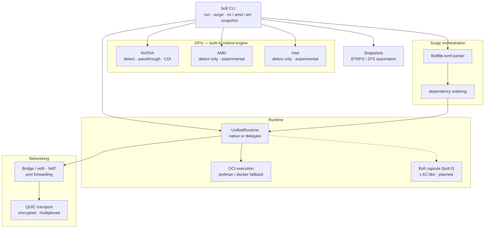
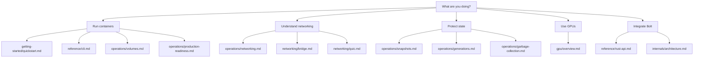

# Bolt Documentation

## Quick Links

| Document | Description |
|----------|-------------|
| [Quickstart](getting-started/quickstart.md) | Installation and first container |
| [CLI Reference](reference/cli.md) | Commands and options |
| [Rust API](reference/rust-api.md) | Programmatic container management |
| [Native Service Tools](reference/native-tools.md) | Built-in docker-mcp-like service tooling |
| [GPU Overview](gpu/overview.md) | Native NVIDIA, AMD, and Intel GPU passthrough |
| [Gaming Workloads](workloads/gaming.md) | Gaming profiles and optimization |
| [AI/ML Workloads](workloads/ai-ml.md) | Ollama, training, and inference |
| [Surge Orchestration](operations/orchestration.md) | Multi-service Boltfile stacks |
| [Networking Overview](operations/networking.md) | Network modes, DNS, and ports |
| [Bridge Networking](networking/bridge.md) | Bridge/veth/IPAM lifecycle |
| [Host Networking](networking/host-networking.md) | Shared host network mode |
| [QUIC Networking](networking/quic.md) | Quinn endpoints, proxy health, RTT |
| [Snapshots](operations/snapshots.md) | BTRFS/ZFS automation and rollback safety |
| [Generations](operations/generations.md) | Snapshot-backed generation inspection and GC protection |
| [Volumes](operations/volumes.md) | Named volume lifecycle, metadata, and usage tracking |
| [Garbage Collection](operations/garbage-collection.md) | Native image/runtime-root GC |
| [Production Readiness](operations/production-readiness.md) | Local gates, runtime gates, and known readiness gaps |
| [Architecture](internals/architecture.md) | Runtime subsystem map and lifecycle diagrams |
| [Accepted Advisories](advisories/accepted.md) | Current accepted security risks |
| [Resolved Advisories](advisories/resolved.md) | Fixed advisory evidence |

## Overview

Bolt is a container runtime with native GPU support. The NVIDIA nvbind path is built into Bolt, so it does not require the external nvbind crate or nvidia-container-toolkit.

**Core features:**
- Multi-vendor GPU passthrough (NVIDIA, AMD, Intel)
- CDI v0.6.0 specification generation
- Gaming and AI/ML profile system
- Surge orchestration (docker-compose alternative)
- BTRFS/ZFS snapshot automation
- QUIC networking
- Docker-compatible CLI

## Architecture

A single `bolt` CLI drives every subsystem. The runtime executes containers
(natively where possible, delegating to podman/docker otherwise); GPU, networking,
orchestration, and snapshots are layered services it composes. Dashed edges mark
paths that are planned or still rolling out.



## Documentation Map



## Structure

```
docs/
├── advisories/
├── getting-started/
├── gpu/
├── internals/
├── networking/
├── operations/
├── reference/
└── workloads/
```
