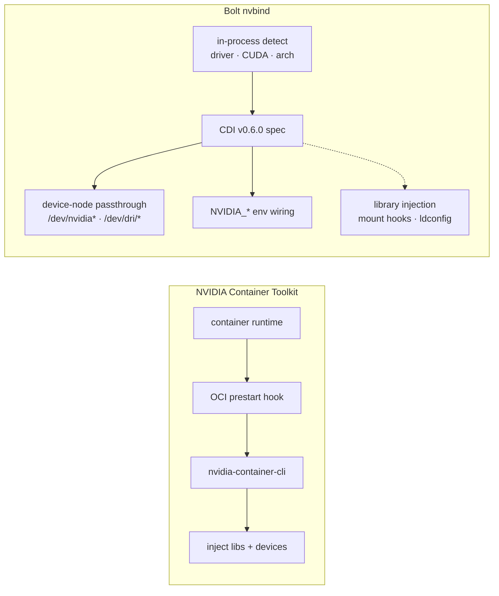
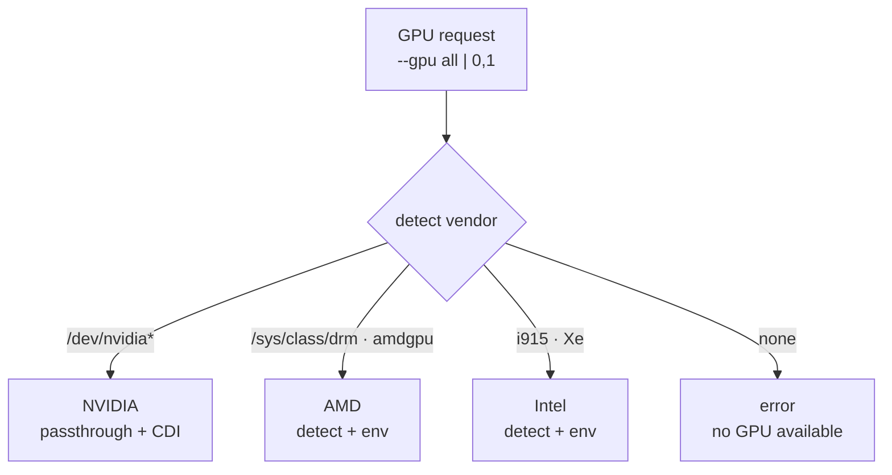

# GPU Support

Bolt provides native GPU integration via the built-in **nvbind** engine without
external tooling. NVIDIA has device passthrough and CDI v0.6.0 spec generation
today; AMD and Intel are at the detection and environment stage (see status
table).

## How nvbind Differs

The NVIDIA Container Toolkit runs an OCI prestart hook that shells out to
`nvidia-container-cli` to inject driver libraries and device nodes at container
start. Bolt's built-in nvbind engine detects the GPU and driver in-process and
emits a CDI v0.6.0 spec directly — no external toolkit, no `ldconfig` hook in
the critical path. Device-node passthrough and `NVIDIA_*` environment wiring
work today; full library injection (CDI mount hooks, in-container `ldconfig`
refresh) is on the roadmap and shown with dashed edges.



## Supported GPUs

| Vendor | Driver | Status |
|--------|--------|--------|
| NVIDIA | Open GPU Kernel Modules | Device passthrough + CDI |
| NVIDIA | Proprietary | Device passthrough + CDI |
| AMD | AMDGPU / AMDGPU-PRO | Detection (experimental) |
| AMD | ROCm | Detection (experimental) |
| Intel | i915 / Xe | Detection (experimental) |
| Intel | oneAPI / Level Zero | Detection (experimental) |

**Status legend:**
- **Device passthrough + CDI** — GPU/driver/CUDA detection, device-node passthrough,
  CDI v0.6.0 spec generation, and `NVIDIA_*` environment wiring. Full
  nvidia-container-toolkit-style library injection (CDI hooks, `ldconfig` refresh)
  is on the roadmap.
- **Detection (experimental)** — GPU and driver detection plus environment-variable
  setup. Full container device passthrough is not yet implemented.

## Quick Start

```bash
# Check GPU availability
bolt nv info      # NVIDIA
bolt amd info     # AMD
bolt arc info     # Intel

# Run diagnostics
bolt nv doctor

# Run container with GPU
bolt run --gpu all nvidia/cuda:12.0-base nvidia-smi
```

## Detection Flow

On a GPU request, Bolt scans for a vendor driver and routes to the matching
detector. Only the NVIDIA branch performs device passthrough today; AMD and
Intel resolve to detection plus environment setup.



## NVIDIA

### Detection
Bolt auto-detects:
- Driver type (Open/Proprietary/Nouveau)
- Driver and CUDA versions
- GPU architecture (Maxwell through Blackwell)
- Compute capability

### Device Passthrough
```bash
# All GPUs
bolt run --gpu all <image>

# Specific GPUs
bolt run --gpu 0 <image>
bolt run --gpu 0,1 <image>
```

### Architectures Supported
| Architecture | GPUs | Features |
|--------------|------|----------|
| Blackwell | RTX 50 series | FP4, 5th gen Tensor |
| Ada Lovelace | RTX 40 series | DLSS 3, 4th gen Tensor |
| Hopper | H100/H200 | FP8, Transformer Engine |
| Ampere | RTX 30, A100 | DLSS 2, 3rd gen Tensor |
| Turing | RTX 20 | DLSS 1, RT Cores |

## AMD

> **Experimental:** AMD support currently covers detection and environment setup.
> Full container device passthrough is on the roadmap.

### Detection
Bolt detects via `/sys/class/drm` and `lspci`:
- AMDGPU/AMDGPU-PRO drivers
- ROCm installation
- GPU architecture (GCN, RDNA, CDNA)

### ROCm Support
```bash
# Check ROCm status
bolt amd rocm status

# Run ROCm workload
bolt run --gpu all rocm/pytorch
```

## Intel

> **Experimental:** Intel support currently covers detection and environment setup.
> Full container device passthrough is on the roadmap.

### Detection
Bolt detects:
- i915 / Xe drivers
- oneAPI installation
- Level Zero runtime
- Arc discrete GPUs

### oneAPI Support
```bash
# Check oneAPI status
bolt arc oneapi status
bolt arc oneapi level-zero
```

## CDI Integration

Bolt generates CDI v0.6.0 specs for container runtimes.

```bash
# Generate CDI spec
bolt nv cdi generate --output /etc/cdi/nvidia.json

# With profile optimization
bolt nv cdi generate --profile gaming
bolt nv cdi generate --profile aiml

# Validate spec
bolt nv cdi validate /etc/cdi/nvidia.json
```

### CDI Spec Contents
- Device nodes (`/dev/nvidia*`, `/dev/dri/*`)
- Library mounts (CUDA, Vulkan ICDs)
- Environment variables
- Profile-specific optimizations

## Environment Variables

### NVIDIA
```bash
NVIDIA_VISIBLE_DEVICES=all
NVIDIA_DRIVER_CAPABILITIES=all
CUDA_VERSION=12.x
```

### AMD
```bash
HIP_VISIBLE_DEVICES=0
ROCR_VISIBLE_DEVICES=0
HSA_OVERRIDE_GFX_VERSION=10.3.0
```

### Intel
```bash
ZE_AFFINITY_MASK=0
ONEAPI_DEVICE_SELECTOR=level_zero:*
```

## Troubleshooting

### No GPUs detected
```bash
# Check driver loaded
lsmod | grep nvidia
lsmod | grep amdgpu
lsmod | grep i915

# Check devices exist
ls -la /dev/nvidia* /dev/dri/*

# Run diagnostics
bolt nv doctor
```

### Permission denied
```bash
# Add user to required groups
sudo usermod -aG video,render $USER

# For NVIDIA
sudo usermod -aG nvidia $USER
```
