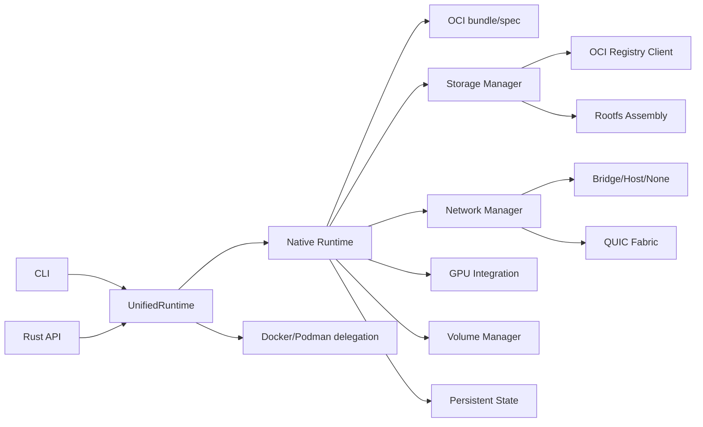
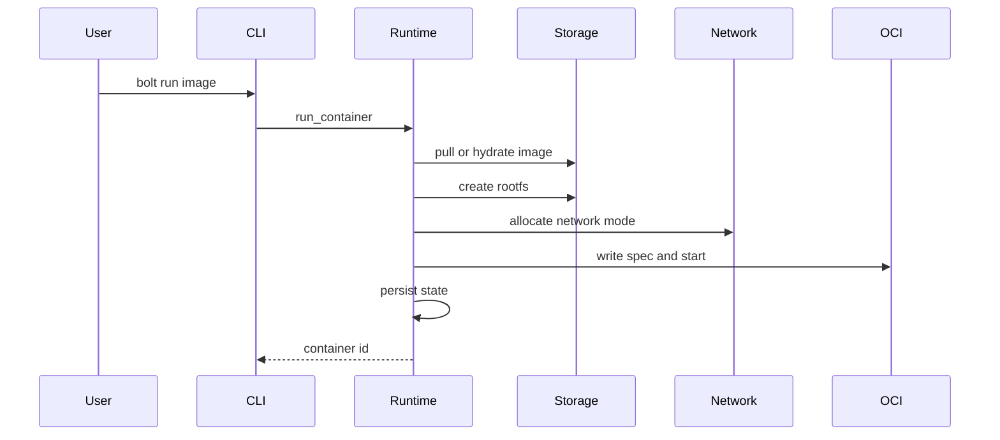
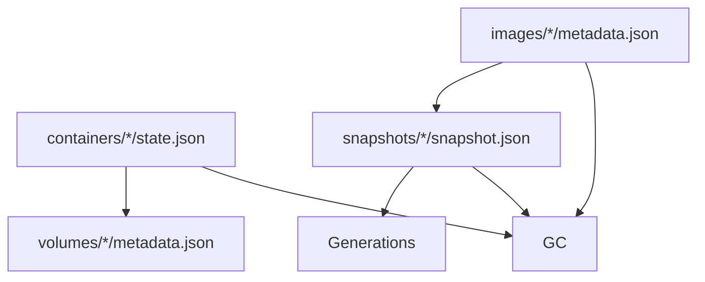

# Architecture

Bolt is split into runtime orchestration, storage, networking, GPU integration, and operational metadata. The native runtime owns container lifecycle and delegates focused work to subsystem managers.

## Lifecycle

## Operational State

Persistent metadata is intentionally plain JSON so operators can inspect state directly during recovery.
