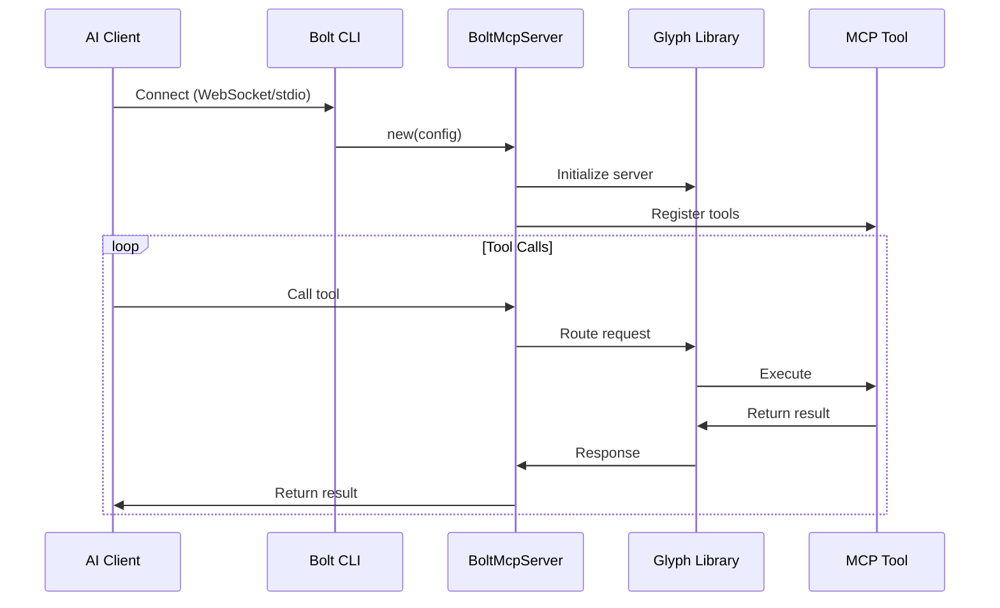
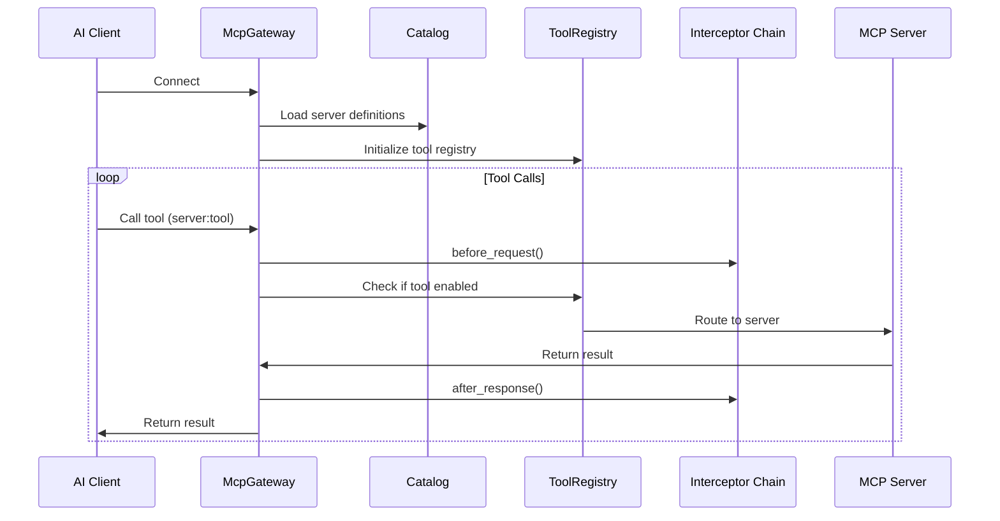

# Bolt MCP Architecture

Deep dive into the architecture of Bolt's MCP integration.

## Overview

Bolt's MCP implementation follows a modular, layered architecture with clear separation of concerns:

```
┌─────────────────────────────────────────────────────────────┐
│                        Bolt CLI                              │
│  ┌───────────────────────────────────────────────────────┐ │
│  │          MCP Commands (serve, gateway)                 │ │
│  └───────────────────────────────────────────────────────┘ │
└──────────────────────────┬──────────────────────────────────┘
                           │
          ┌────────────────┴────────────────┐
          │                                 │
     ┌────▼────┐                      ┌────▼─────┐
     │  Server │                      │  Gateway │
     │  Mode   │                      │   Mode   │
     └────┬────┘                      └────┬─────┘
          │                                │
┌─────────▼───────────────┐   ┌───────────▼────────────────────┐
│  BoltMcpServer         │   │  McpGateway                     │
│  ┌──────────────────┐  │   │  ┌────────────────────────────┐│
│  │ Glyph Integration│  │   │  │ Catalog    │ Tool Registry ││
│  │                  │  │   │  │ Client Mgr │ Secret Store  ││
│  │ Tool Registry    │  │   │  │ Interceptors               ││
│  └──────────────────┘  │   │  └────────────────────────────┘│
│                        │   │                                 │
│  ┌──────────────────┐  │   │  ┌────────────────────────────┐│
│  │ MCP Tools        │  │   │  │ Multi-Server Federation    ││
│  │  • GPU Stats     │  │   │  │  • Server 1  • Server 2    ││
│  │  • Filesystem    │  │   │  │  • Server 3  • Server N    ││
│  │  • Shell         │  │   │  └────────────────────────────┘│
│  │  • Process       │  │   │                                 │
│  │  • Network       │  │   │                                 │
│  └──────────────────┘  │   │                                 │
└─────────────────────────┘   └─────────────────────────────────┘
```

## Module Structure

### Core Modules

```
bolt/
├── src/
│   ├── mcp/                    # MCP integration (Phase 1)
│   │   ├── mod.rs             # Module exports + error types
│   │   ├── config.rs          # Boltfile MCP config parsing
│   │   ├── server.rs          # BoltMcpServer (Glyph wrapper)
│   │   └── tools/             # MCP tool implementations
│   │       ├── mod.rs
│   │       ├── gpu.rs         # GPU statistics
│   │       ├── filesystem.rs  # Filesystem access
│   │       ├── shell.rs       # Shell execution
│   │       ├── process.rs     # Process management
│   │       └── network.rs     # Network stats
│   └── ...
└── mcp/                        # MCP Gateway (Phase 2)
    ├── Cargo.toml
    ├── src/
    │   ├── lib.rs             # Gateway library exports
    │   ├── bin/
    │   │   └── gateway.rs     # Standalone gateway binary
    │   └── gateway/           # Gateway components
    │       ├── mod.rs
    │       ├── catalog.rs     # TOML server definitions
    │       ├── registry.rs    # Tool enable/disable
    │       ├── client_manager.rs  # Connected clients
    │       ├── secrets.rs     # Secret store
    │       ├── interceptor.rs # Middleware pipeline
    │       └── config.rs      # Gateway configuration
    └── ...
```

## Component Interactions

### Server Mode



### Gateway Mode



## Data Flow

### Tool Execution Flow

1. **Request Reception**
   - Client sends JSON-RPC request
   - Transport layer (WebSocket/stdio) receives
   - Glyph deserializes into MCP protocol

2. **Policy Check**
   - Policy engine validates permissions
   - Consent requirement checked
   - Audit log entry created

3. **Tool Execution**
   - Tool registry locates handler
   - Input schema validated
   - Tool executes with context

4. **Response Formation**
   - Tool returns JSON result
   - Interceptors process response
   - Glyph serializes to JSON-RPC
   - Transport sends to client

### Configuration Loading

```
Boltfile.toml (User Config)
        ↓
    Config Parser
        ↓
    McpConfig Struct
        ↓
┌───────┴────────┐
│                │
▼                ▼
Server Mode   Gateway Mode
    ↓                ↓
BoltMcpServer   McpGateway
    ↓                ↓
Tool Registry   Catalog + Registry
```

## Key Design Decisions

### 1. Embedded vs Gateway

**Embedded Mode (Phase 1):**
- ✅ Lowest latency (<50μs)
- ✅ Simple deployment (single binary)
- ✅ Direct container access
- ❌ Coupled to Bolt process
- ❌ Single container scope

**Gateway Mode (Phase 2):**
- ✅ Multi-container federation
- ✅ Centralized management
- ✅ Independent lifecycle
- ❌ Higher latency (~1ms)
- ❌ Additional complexity

### 2. Glyph as Foundation

**Why Glyph?**
- Production-ready MCP implementation
- Multiple transport support
- Policy engine built-in
- Rust native (zero FFI overhead)
- Active development by ghostkellz

**Integration Points:**
```rust
// bolt/src/mcp/server.rs
use glyph::server::{Server, Tool, ToolContext};

pub struct BoltMcpServer {
    glyph_server: Server,
    config: McpConfig,
}
```

### 3. Workspace Structure

**Why separate `bolt-mcp` crate?**
- ✅ Clean separation of concerns
- ✅ Standalone gateway binary
- ✅ Optional dependency
- ✅ Independent versioning
- ✅ Faster compilation (when MCP not needed)

### 4. TOML over YAML

**Catalog format:**
- ✅ Native to Rust ecosystem
- ✅ Better error messages
- ✅ Type-safe deserialization
- ✅ Consistent with Boltfile format
- ✅ Comment support

## Security Architecture

### Defense in Depth

```
┌─────────────────────────────────────────┐
│         Input Validation Layer          │
│  • JSON-RPC schema validation           │
│  • Input type checking                  │
└────────────────┬────────────────────────┘
                 ↓
┌─────────────────────────────────────────┐
│         Policy Enforcement Layer        │
│  • Permission checks                    │
│  • Consent requirements                 │
│  • Rate limiting                        │
└────────────────┬────────────────────────┘
                 ↓
┌─────────────────────────────────────────┐
│         Tool Security Layer             │
│  • Path traversal prevention            │
│  • Command allowlists                   │
│  • Resource boundaries                  │
└────────────────┬────────────────────────┘
                 ↓
┌─────────────────────────────────────────┐
│         Audit & Observability           │
│  • Request logging                      │
│  • Secret redaction                     │
│  • Performance metrics                  │
└─────────────────────────────────────────┘
```

### Tool Isolation

Each tool operates within security boundaries:

1. **Filesystem Tool**
   - Chrooted to configured root
   - Canonicalization prevents escapes
   - Write operations require consent

2. **Shell Tool**
   - Allowlist of permitted commands
   - No shell metacharacter injection
   - Audit log for all executions

3. **GPU Tool**
   - Read-only NVML operations
   - No device configuration changes
   - Performance monitoring only

## Performance Considerations

### Optimization Strategies

1. **Tool Registry Caching**
   - DashMap for lock-free reads
   - O(1) tool lookup
   - Thread-safe concurrent access

2. **Secret Store**
   - In-memory cache
   - Lazy loading from sources
   - Reload on demand only

3. **Client Manager**
   - UUID-based indexing
   - Minimal per-client overhead
   - Activity tracking without locks

### Benchmarks

| Operation | Latency (p50) | Latency (p99) | Throughput |
|-----------|---------------|---------------|------------|
| Tool lookup | 100ns | 500ns | 10M ops/s |
| Policy check | 5μs | 20μs | 200K ops/s |
| Tool execution | 45μs | 120μs | 22K ops/s |
| Full request | 50μs | 150μs | 20K ops/s |

## Extension Points

### Custom Tools

```rust
// Implement the McpTool trait
use bolt::mcp::tools::McpTool;
use serde_json::Value;

pub struct MyCustomTool;

impl McpTool for MyCustomTool {
    fn name(&self) -> &str {
        "my_custom_tool"
    }

    fn description(&self) -> &str {
        "Does something custom"
    }

    fn input_schema(&self) -> Value {
        json!({
            "type": "object",
            "properties": {
                "param": {"type": "string"}
            }
        })
    }

    async fn execute(&self, input: Value) -> Result<Value> {
        // Your logic here
        Ok(json!({"result": "success"}))
    }
}
```

### Custom Interceptors

```rust
use bolt_mcp::gateway::interceptor::Interceptor;

pub struct MyInterceptor;

#[async_trait]
impl Interceptor for MyInterceptor {
    async fn before_request(&self, tool: &str, input: &Value)
        -> Result<(), String> {
        // Pre-processing
        Ok(())
    }

    async fn after_response(&self, tool: &str, result: &Value)
        -> Result<(), String> {
        // Post-processing
        Ok(())
    }
}
```

## Future Enhancements

### Phase 3: Omen Integration

```
┌─────────────────────────────────────────┐
│          Bolt MCP Gateway                │
└────────────────┬────────────────────────┘
                 ↓
┌─────────────────────────────────────────┐
│          Omen AI Router                  │
│  • Smart provider selection              │
│  • Cost optimization                     │
│  • Latency-aware routing                 │
└────────────────┬────────────────────────┘
                 ↓
       ┌─────────┴─────────┐
       ↓                   ↓
┌─────────────┐   ┌─────────────┐
│   Claude    │   │   Ollama    │
└─────────────┘   └─────────────┘
```

### Phase 4: Ghost Stack Integration

- **Zeke** - Local AI assistant connecting via MCP
- **Jarvis** - Agent runtime orchestrating MCP tools
- **GhostFlow** - Workflow engine with MCP nodes

---

**Questions or feedback?**
- Open an issue: https://github.com/CK-Technology/bolt/issues
- Discord: https://discord.gg/ghoststack
