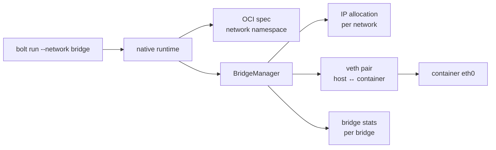
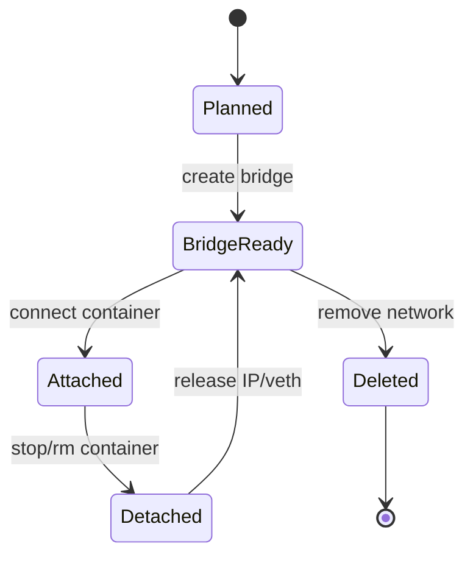

# Bridge Networking

Bolt bridge networking keeps the familiar Linux bridge/veth model, but tracks
container attachments and IP allocation in runtime state so cleanup and stats can
reason about the actual bridge a container joined.



## Current Behavior

- `bridge` and `bolt` keep a private network namespace in the OCI spec.
- `host` omits the OCI network namespace.
- `none` configures loopback-only networking.
- `container:<id>` is rejected until namespace sharing is implemented.
- Bridge stats count interfaces attached to the requested bridge only.

## Safety Model

Bridge cleanup should be idempotent. The runtime records interface allocation so
disconnect and delete can remove only interfaces attached to the target bridge.
Future netlink work should keep that state model and replace logging fallbacks
with capability-gated netlink operations.



## Verification

```bash
cargo test --lib networking::bridge
bolt run --network bridge -p 8080:80 nginx:latest
bolt ps -a
```
