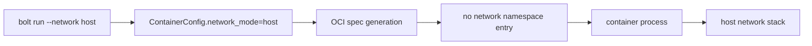

# Host Networking

Host networking is the explicit no-namespace path. When `--network host` is
selected, Bolt omits the OCI network namespace and the process joins the host
network stack directly.

## Behavior

- No bridge, veth, IPAM, DNS, or NAT is configured by Bolt.
- Port mappings are not meaningful in host mode and should be treated as a
  configuration smell by future validation.
- This is the right mode when host firewall/DNS policy is already managed
  externally and the container must see that exact network.

## Operational Notes

Host mode expands the blast radius of a process because it shares host sockets.
Use it for trusted workloads and debugging, not as the default for multi-service
stacks.
