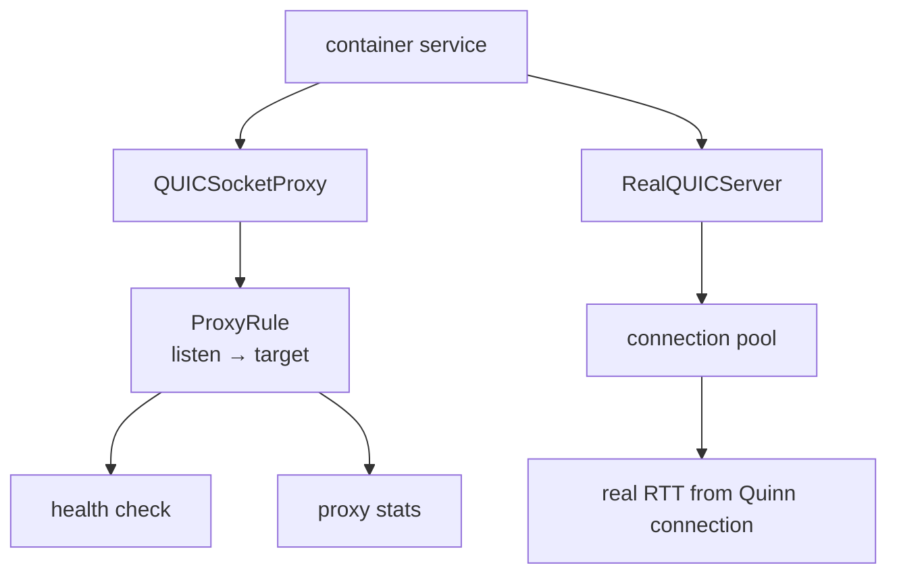
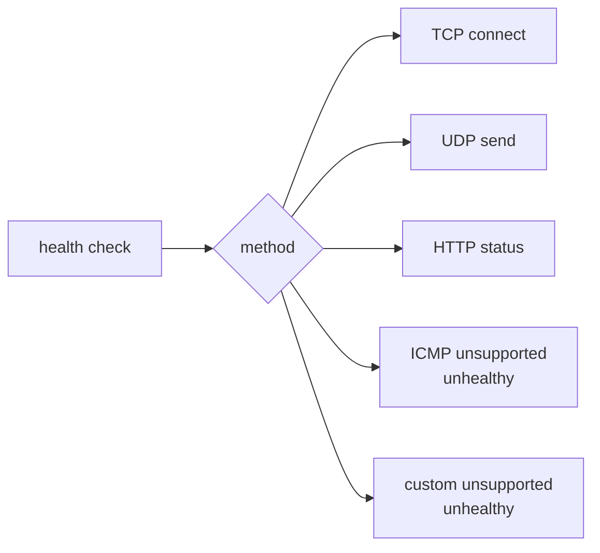

# QUIC Networking

Bolt has two QUIC-facing layers:

- `networking::quic_real` uses Quinn for real QUIC endpoints, pooled
  connections, RTT reporting, and deterministic container/network IP allocation.
- `networking::quic_proxy` handles socket proxy rules, health checks, and
  traffic shaping metadata.

## Health Checks

TCP, UDP, and HTTP checks are implemented. Unsupported ICMP and custom checks
fail closed: they return unhealthy instead of assuming the target is healthy.

## Current Limits

- Service discovery is still local runtime state, not a distributed catalog.
- QUIC port forwarding exists as tracked rules, but full multi-host routing is
  not a Phase D exit criterion yet.
- Backpressure and reconnect policy should be promoted before QUIC is described
  as production multi-host networking.
