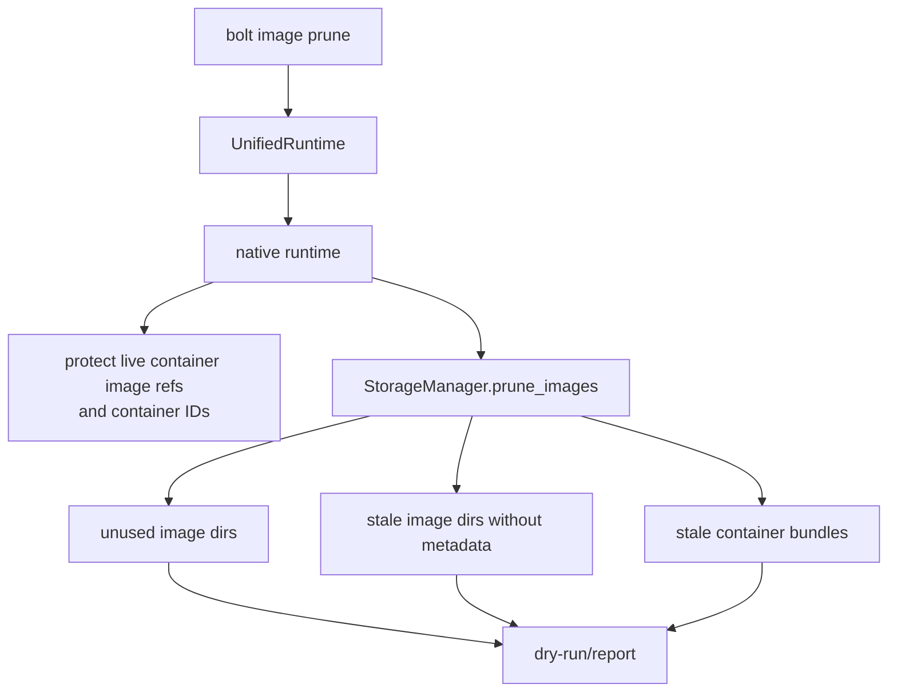

# Garbage Collection

Native GC is rooted in persisted runtime state. `bolt image prune` now reports
unused image cache entries and stale runtime roots, with dry-run as the default
unless `--force` is passed.



## Commands

```bash
# Preview only
bolt image prune --dry-run

# Also preview, because --force is absent
bolt image prune

# Remove unreferenced native image/runtime roots
bolt image prune --force
```

## Protected Roots

- Images referenced by persisted containers are protected.
- Container bundle directories whose IDs are present in runtime state are
  protected.
- Future generation metadata will become an additional GC root.

## Output Shape

The prune report separates image candidates from runtime-root candidates and
includes byte counts for both categories.
