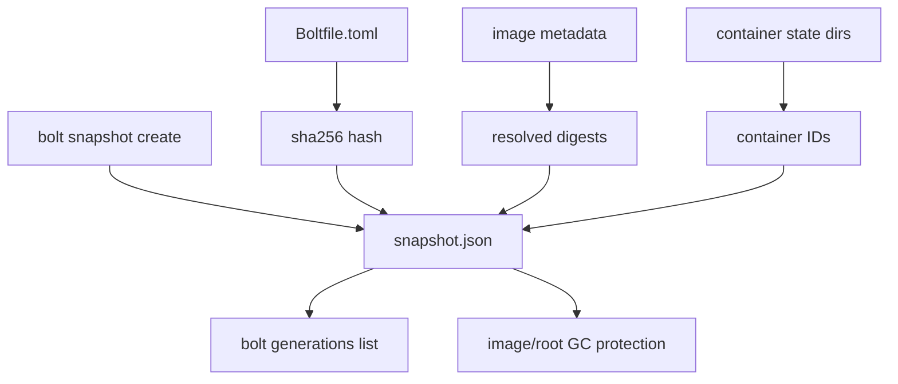

# Generations

Generations are a read-only view over snapshot metadata. A generation records the snapshot name, creation time, container IDs, image digests, and Boltfile provenance captured when the snapshot was created.



## CLI

```bash
bolt generations list
bolt generations list --verbose
```

The compact view shows generation ID, creation time, container count, and image count. Verbose output includes Boltfile path/hash, git revision when available, container IDs, and image digests.

## GC Protection

Image GC protects image digests referenced by generations, even if no running container currently references the original tag. Root GC also treats generation container IDs as protected roots.

This makes snapshot metadata part of the retention contract: deleting old snapshots removes their generation protection.
