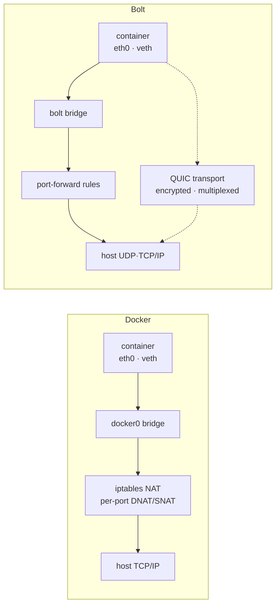
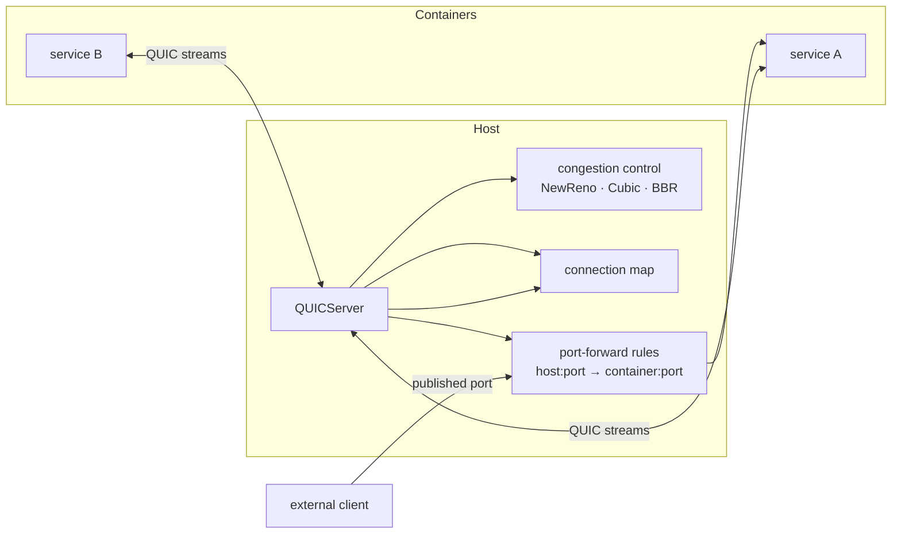

# Networking

Bolt provides QUIC-based networking for container communication.

## Networking Model

Docker routes container traffic through a Linux bridge (`docker0`) and rewrites
packets with iptables NAT for every published port. Bolt keeps the familiar
bridge/veth data path for compatibility, but layers an optional QUIC transport
for encrypted, multiplexed service-to-service traffic. Dashed edges mark the
QUIC path, which is still rolling out.



## Networks

### Create Network
```bash
bolt network create my-network --driver bolt --subnet 172.20.0.0/16
```

### List Networks
```bash
bolt network ls
```

### Remove Network
```bash
bolt network rm my-network
```

## Boltfile Configuration

```toml
[networks.frontend]
driver = "bolt"
subnet = "172.20.0.0/16"
gateway = "172.20.0.1"

[networks.backend]
driver = "bolt"
subnet = "172.21.0.0/16"
internal = true  # No external access

[services.web]
image = "nginx:latest"
networks = ["frontend"]

[services.api]
image = "myapi:latest"
networks = ["frontend", "backend"]

[services.db]
image = "postgres:16"
networks = ["backend"]
```

## Port Mapping

### CLI
```bash
bolt run -p 8080:80 nginx:latest
bolt run -p 127.0.0.1:3000:3000 myapp:latest
bolt run -p 8080:80 -p 8443:443 nginx:latest
```

### Boltfile
```toml
[services.web]
image = "nginx:latest"
ports = ["8080:80", "8443:443"]
```

## DNS Resolution

`bolt apply` writes a local service-discovery registry after Surge has attempted
to converge the stack. `bolt dns hosts` renders that registry as hosts-style
entries, and `bolt dns resolve <service|name.project.bolt>` shows the structured
entry.

```bash
bolt dns hosts
bolt dns resolve web.my-app.bolt
```

Entries include:

- `dns_name`: `<service>.<project>.bolt`
- `protocol`: `tcp` or `quic` based on the configured networks
- `healthy`: derived from live runtime status when a container exists
- `address_source`: `host-network`, `published-port-loopback`,
  `container-state-no-address`, or `configured-fallback`

```json
{
  "service": "web",
  "dns_name": "web.my-app.bolt",
  "address": "127.0.0.1",
  "address_source": "published-port-loopback",
  "healthy": true
}
```

Private bridge container IPs are not exposed through public `ContainerInfo` yet,
so unpublished bridge services are marked as `container-state-no-address` until
the runtime exports attachment IPs.

## QUIC Protocol

Bolt uses QUIC for container-to-container communication:

- Zero-RTT connection establishment
- Multiplexed streams
- Built-in encryption
- Connection migration

A `QUICServer` tracks live connections and host-port forwards, selecting a
congestion controller per workload profile — BBR for latency-sensitive traffic,
Cubic for bandwidth-heavy transfers, with NewReno as the conservative default.



## Focused Networking Docs

- [Bridge networking](../networking/bridge.md) - bridge/veth/IPAM lifecycle and stats
- [Host networking](../networking/host-networking.md) - no-network-namespace behavior
- [QUIC networking](../networking/quic.md) - Quinn endpoint/proxy health model

## Environment Variables

```bash
# Inside containers
BOLT_NETWORK=my-network
BOLT_HOSTNAME=my-service
BOLT_DNS_SERVER=172.20.0.1
```

## Troubleshooting

### Container Can't Reach Another
```bash
# Check both on same network
bolt network ls

# Verify DNS resolution
bolt exec container1 ping container2
```

### Port Already in Use
```bash
# Find process using port
lsof -i :8080

# Use different host port
bolt run -p 8081:80 nginx:latest
```
