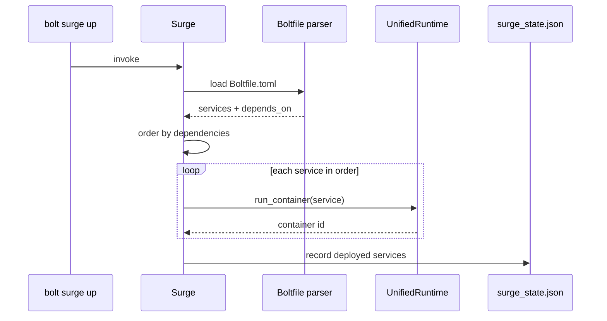

# Orchestration (Surge)

Bolt includes **Surge**, a built-in orchestration system for multi-service stacks.

## How `surge up` Works

Surge parses `Boltfile.toml`, orders services by their `depends_on` edges, then
launches each one through the `UnifiedRuntime`. The set of started services is
persisted to `surge_state.json` so `surge down` and `surge status` can act on
the running stack.



## Boltfile.toml

Create a `Boltfile.toml` in your project root:

```toml
project = "my-app"

[services.web]
image = "nginx:latest"
ports = ["8080:80"]
volumes = ["./html:/usr/share/nginx/html"]

[services.api]
image = "node:20"
ports = ["3000:3000"]
volumes = ["./app:/app"]
depends_on = ["db"]

[services.db]
image = "postgres:16"
environment = { POSTGRES_PASSWORD = "secret" }
volumes = ["pgdata:/var/lib/postgresql/data"]

[volumes.pgdata]
driver = "local"

[networks.default]
driver = "bolt"
```

## Commands

```bash
# Start all services
bolt surge up

# Start in background
bolt surge up --detach

# Stop all services
bolt surge down

# View status
bolt surge status

# View logs
bolt surge logs
bolt surge logs api --follow
```

## Service Configuration

### Basic Options
```toml
[services.myapp]
image = "myimage:tag"           # Required: container image
ports = ["8080:80"]             # Port mappings
volumes = ["./data:/data"]      # Volume mounts
environment = { KEY = "value" } # Environment variables
depends_on = ["db", "cache"]    # Service dependencies
restart = "always"              # Restart policy
```

### GPU Services
```toml
[services.ml-inference]
image = "ollama/ollama"
ports = ["11434:11434"]

[services.ml-inference.gpu]
devices = "all"
profile = "ollama-medium"
```

### Gaming Services
```toml
[services.steam]
image = "ghcr.io/games-on-whales/steam:latest"
ports = ["8080:8080"]

[services.steam.gpu]
devices = "all"
profile = "cyberpunk 2077"

[services.steam.gaming]
wine_optimizations = true
audio_system = "pipewire"
```

## Networks

```toml
[networks.frontend]
driver = "bolt"
subnet = "172.20.0.0/16"

[networks.backend]
driver = "bolt"
subnet = "172.21.0.0/16"
internal = true  # No external access
```

## Volumes

```toml
[volumes.data]
driver = "local"

[volumes.cache]
driver = "local"
```

## Health Checks

```toml
[services.api]
image = "myapi:latest"

[services.api.healthcheck]
test = ["CMD", "curl", "-f", "http://localhost:3000/health"]
interval = "30s"
timeout = "10s"
retries = 3
```

## Examples

### Development Stack
```toml
project = "dev-stack"

[services.app]
image = "node:20"
ports = ["3000:3000"]
volumes = ["./src:/app/src"]
environment = { NODE_ENV = "development" }

[services.db]
image = "postgres:16"
environment = { POSTGRES_DB = "dev", POSTGRES_PASSWORD = "dev" }

[services.redis]
image = "redis:7-alpine"
```

### AI/ML Stack
```toml
project = "ml-stack"

[services.ollama]
image = "ollama/ollama"
ports = ["11434:11434"]
volumes = ["ollama-models:/root/.ollama"]

[services.ollama.gpu]
devices = "all"
profile = "ollama-medium"

[services.webui]
image = "ghcr.io/open-webui/open-webui:main"
ports = ["3000:8080"]
depends_on = ["ollama"]
environment = { OLLAMA_BASE_URL = "http://ollama:11434" }

[volumes.ollama-models]
driver = "local"
```

### Gaming Stack
```toml
project = "gaming"

[services.steam]
image = "ghcr.io/games-on-whales/steam:latest"

[services.steam.gpu]
devices = "all"
profile = "gaming-ultra"

[services.steam.gaming]
wine_optimizations = true
dlss_enabled = true
```
