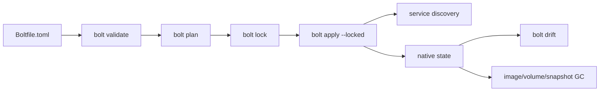

# Production Readiness

Bolt's project-control path is converging on a Docker + Nix + Terraform style
workflow: declarative files, immutable locks, native runtime state, and explicit
drift checks.



## Local Gates

```bash
cargo check --lib --bin bolt
cargo test --lib
scripts/project-smoke.sh
```

Use `BOLT_PROJECT_SMOKE_APPLY=1 scripts/project-smoke.sh` when registry and
runtime networking are available. The default smoke uses repo-local `.scratch`
state and a digest-pinned fixture image so it can run without registry access.

## Runtime Gates

- `bolt validate` must pass before a project is considered ready to apply.
- `bolt lock` must resolve tag-based images to digests.
- `bolt apply --locked` must reject stale locks and unresolved tag digests.
- `bolt dns hosts` should show live post-apply service metadata.
- `bolt drift` should report no drift after a clean apply.
- `bolt image prune --dry-run` should explain protected images and candidates.

## Current Known Gaps

- Private bridge container IPs are not exported through public `ContainerInfo`
  yet, so DNS uses loopback/published-port metadata where possible.
- QUIC service discovery is local runtime metadata, not a distributed catalog.
- AMD and Intel GPU paths are still detection/environment focused; NVIDIA has
  the strongest native passthrough/CDI path.
- Full apply-mode smoke needs a host with registry access and sufficient runtime
  networking permissions.
