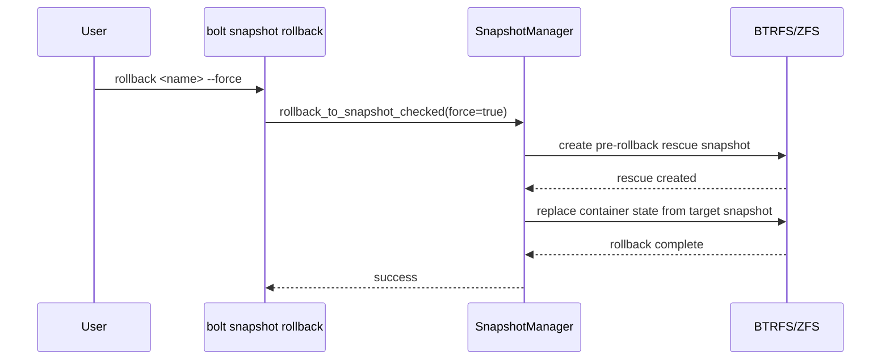

# Snapshots

Bolt provides BTRFS/ZFS snapshot management with explicit capability checks,
dry-run delete/cleanup paths, and rollback safeguards.

## Requirements

- BTRFS or ZFS filesystem
- Root or appropriate permissions
- `btrfs`, `zfs`, and `findmnt` available as appropriate for the backend

## Quick Start

```bash
# Create snapshot
bolt snapshot create --name "before-update"

# Check backend support
bolt snapshot preflight

# List snapshots
bolt snapshot list

# Rollback requires --force and creates a rescue snapshot first
bolt snapshot rollback before-update --force

# Cleanup old snapshots
bolt snapshot cleanup --dry-run
bolt snapshot cleanup --force
```

## Commands

### Create
```bash
bolt snapshot create --name "my-snapshot" --description "Before major change"
```

### List
```bash
bolt snapshot list
bolt snapshot list --verbose
```

### Rollback
```bash
bolt snapshot rollback my-snapshot --force
```

### Delete
```bash
bolt snapshot delete my-snapshot --dry-run
bolt snapshot delete my-snapshot --force
```

### Cleanup
```bash
# Preview what would be deleted
bolt snapshot cleanup --dry-run

# Execute cleanup
bolt snapshot cleanup --force
```

## Rollback Flow



## Metadata

`snapshot show` prints generation-oriented metadata:

- Bolt data root
- container state path
- container IDs captured with the snapshot
- image digests referenced by the snapshot

This metadata is the foundation for future `bolt generations` rollback and GC
roots.

## Boltfile Configuration

```toml
[snapshots]
enabled = true
filesystem = "auto"  # auto, btrfs, or zfs

[snapshots.retention]
keep_daily = 7
keep_weekly = 4
keep_monthly = 6
max_total = 50

[snapshots.triggers]
daily = "02:00"           # Daily at 2 AM
before_build = true       # Before image builds
before_surge_up = true    # Before surge operations
min_change_threshold = "100MB"

[[snapshots.named_snapshots]]
name = "stable-config"
description = "Known working configuration"
keep_forever = true

[[snapshots.named_snapshots]]
name = "pre-update"
description = "Before system updates"
```

## Retention Policies

### Time-Based
```toml
[snapshots.retention]
keep_daily = 7      # Keep 7 daily snapshots
keep_weekly = 4     # Keep 4 weekly snapshots
keep_monthly = 6    # Keep 6 monthly snapshots
```

### Count-Based
```toml
[snapshots.retention]
max_total = 50      # Maximum snapshots to keep
```

### Named Snapshots
```toml
[[snapshots.named_snapshots]]
name = "stable"
keep_forever = true  # Never auto-delete
```

## Triggers

### Scheduled
```toml
[snapshots.triggers]
daily = "02:00"     # Every day at 2 AM
weekly = "sun:03:00" # Sundays at 3 AM
```

### Operation-Based
```toml
[snapshots.triggers]
before_build = true      # Before bolt build
before_surge_up = true   # Before bolt surge up
```

### Change-Based
```toml
[snapshots.triggers]
min_change_threshold = "100MB"  # Only if >100MB changed
```

## Filesystem Support

### BTRFS
```bash
# Check if BTRFS
df -T /

# Manual snapshot
btrfs subvolume snapshot /data /data/.snapshots/manual
```

### ZFS
```bash
# Check if ZFS
zfs list

# Manual snapshot
zfs snapshot tank/data@manual
```

## Troubleshooting

### Snapshot Failed
```bash
# Run Bolt's preflight first
bolt snapshot preflight

# Check filesystem type
df -T /path/to/data

# Check permissions
sudo bolt snapshot create --name test

# Check disk space
df -h
```

### Rollback Failed
```bash
# List available snapshots
bolt snapshot list --verbose

# Check snapshot exists
bolt snapshot list | grep my-snapshot

# Rollback requires explicit confirmation
bolt snapshot rollback my-snapshot --force
```

### Cleanup Not Working
```bash
# Preview first
bolt snapshot cleanup --dry-run

# Check retention settings in Boltfile.toml
```
