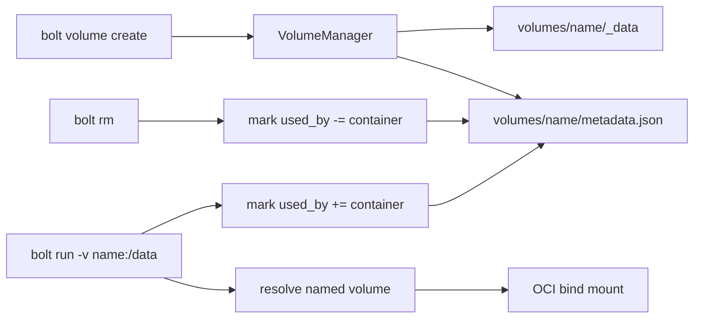

# Volumes

Bolt named volumes live under the runtime storage root and are mounted into OCI bundles as bind mounts. Volume metadata tracks driver, options, size limits, mountpoint, creation time, and the containers currently using the volume.

## Creation Options

Supported local driver options:

- `mode`: octal directory mode such as `0750`
- `uid`: numeric owner UID, applied with `chown`
- `gid`: numeric owner GID, applied with `chown`

The `--size` value is recorded in metadata for scheduling and policy decisions. The local filesystem driver does not enforce a quota by itself; filesystem-backed quota enforcement belongs in the storage backend layer.

## Usage Tracking

Bolt updates `used_by` when a container is created and removed. On startup or volume manager reload, it also reconciles usage from persisted container state so metadata can recover from interrupted operations.

`bolt volume prune --dry-run` is the safe inspection path. A volume with non-empty `used_by` is protected unless removal is forced.
